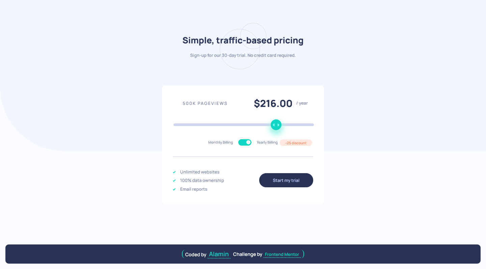

<h1 align="center">Interactive pricing component</h1>
<div align="center">

Challenge from [Frontend Mentor](https://www.frontendmentor.io/profile/CodePapa360)

</div>

<h2 align="center">

[🚀Live Site](https://interactive-pricing-component-alamin.netlify.app/)
|
[💡Frontend Mentor](https://www.frontendmentor.io/solutions/responsive-interactive-pricing-component-my5J8RM48a)

</h2>

<p align="center">
This project is a user-friendly and responsive pricing plan feature created using HTML, CSS, and JavaScript. It was completed as a part of the FrontendMentor challenges to showcase my frontend development skills.
</p>

<a align="center" href="https://interactive-pricing-component-alamin.netlify.app/">



</a>

## The challenge

Users should be able to:

- View the optimal layout for the app depending on their device's screen size
- See hover states for all interactive elements on the page
- Use the slider and toggle to see prices for different page view numbers

## Built with

- Semantic HTML5 markup
- CSS custom properties
- CSS Grid
- JavaScript
- Mobile-first workflow
- NPM
- [Webpack - a module bundler](https://webpack.js.org/)

## What I learned

In this project, I practiced my front-end development skills by creating an interactive pricing component. I used HTML, CSS, and JavaScript to build the component, and I also learned how to use range input types and checkboxes to capture user input.

One of the main challenges I faced was calculating the total cost based on the user's selected options. I used arrays to store the possible page views and their corresponding costs, and then used JavaScript to update the total cost and page views based on the user's input.

Overall, this project helped me further develop my skills in HTML, CSS, and JavaScript, and gave me a better understanding of how to create interactive components for websites.

## Installation

- Clone this repo:

```sh
git clone https://github.com/CodePapa360/Interactive-pricing-component.git
```

- Install dependencies:

```sh
npm install
```

- Build command:

```sh
npm run build
```

- Live server:

```sh
npm start
```

## Author

<b>👤 Alamin</b>

- Twitter - [@CodePapa360](https://www.twitter.com/CodePapa360)
- LinkedIn - [@CodePapa360](https://www.linkedin.com/in/codepapa360)
- Frontend Mentor - [@CodePapa360](https://www.frontendmentor.io/profile/CodePapa360)
- Github: [@CodePapa360](https://github.com/codepapa360)

Feel free to contact me with any questions or feedback!

## Show your support

Give a ⭐️ if you liked this project!

## Acknowledgments

Special thanks to Frontend Mentor for providing such an amazing platform to practice and improve my frontend skills. The challenges and projects available on the website were both fun and challenging, and helped me learn a lot in a short amount of time.

## License

This project is licensed under the [MIT](https://github.com/CodePapa360/Interactive-pricing-component/blob/main/LICENSE.md) license, which means you can use, modify, and distribute the code as you wish. If you have any questions or feedback, feel free to reach out. Thank you for considering my code!
